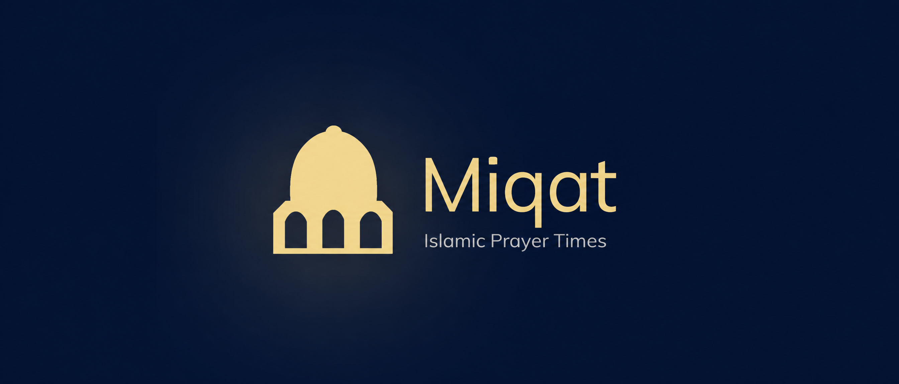
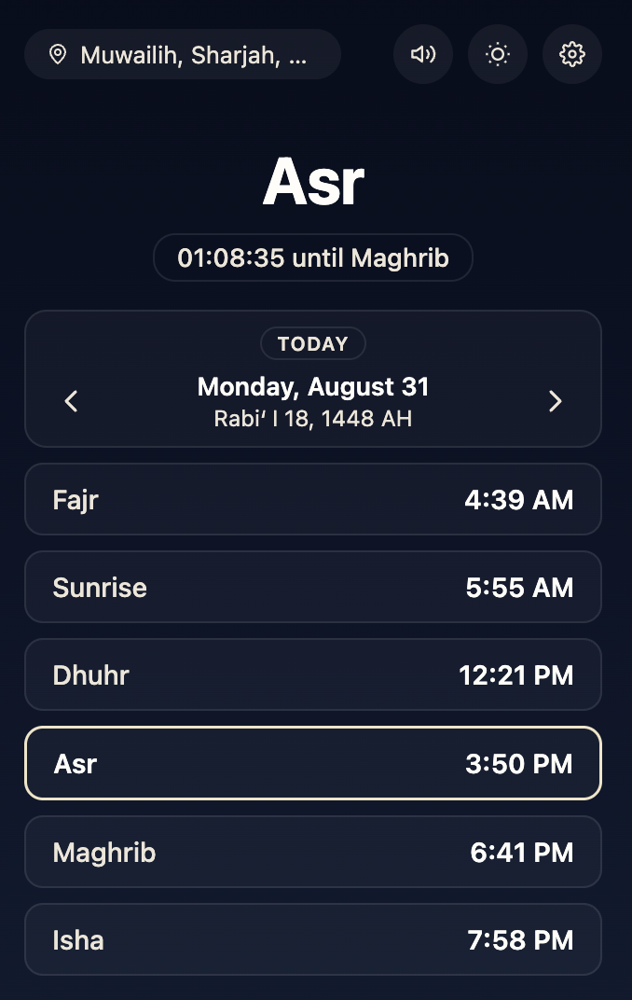
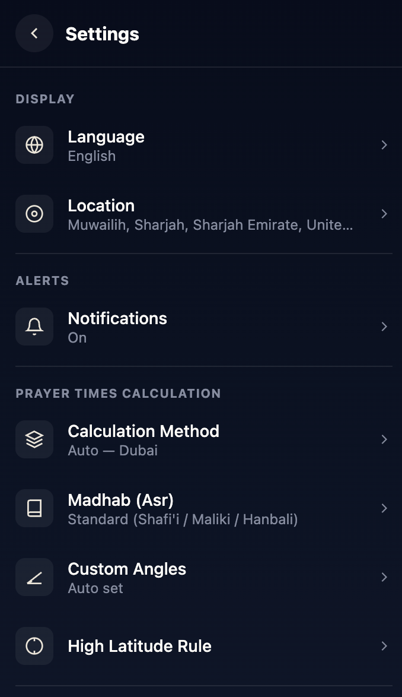
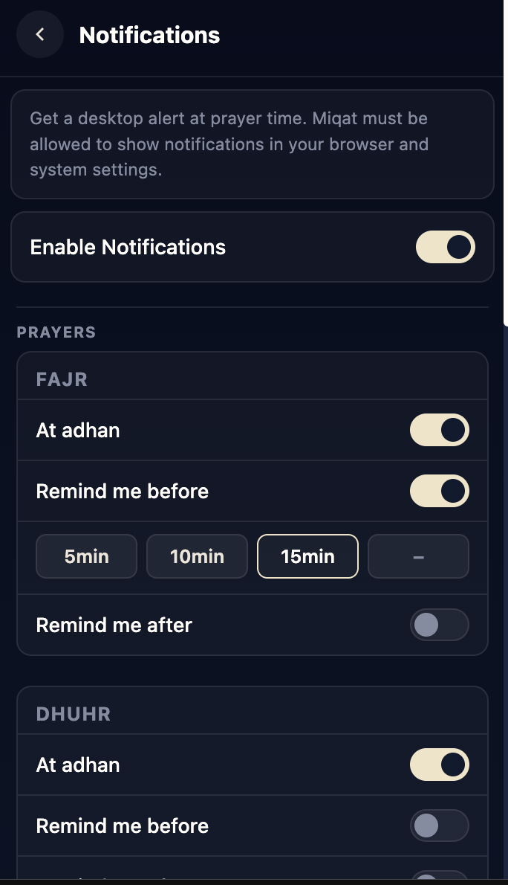

<div align="center">



# 🕌 Miqat — Islamic Prayer Times

**Never miss a prayer. Accurate prayer times for anywhere in the world, right in your browser toolbar.**

[](manifest.json)
[](https://developer.chrome.com/docs/extensions/mv3/intro/)
[](#-supported-languages)
[](#-calculation-methods)
[](PRIVACY_POLICY.md)
[](#-license)

</div>

---

## 📖 Table of Contents

- [About](#-about)
- [Features](#-features)
- [Screenshots](#-screenshots)
- [Prerequisites](#-prerequisites)
- [Installation](#-installation)
- [Usage](#-usage)
- [Configuration](#-configuration)
- [Calculation Methods](#-calculation-methods)
- [Supported Languages](#-supported-languages)
- [Project Structure](#-project-structure)
- [Architecture Notes](#-architecture-notes)
- [Privacy](#-privacy)
- [Contributing](#-contributing)
- [Acknowledgements](#-acknowledgements)
- [License](#-license)

---

## 🌙 About

**Miqat** (ميقات — *"an appointed time or place"*) is a Chrome extension that puts the five daily prayer
times one click away. Set your location once and Miqat handles the rest: a live countdown on the
toolbar badge, desktop notifications at prayer time, and the adhan played through your speakers.

Prayer times are computed **on your device** using the well-tested
[adhan.js](https://github.com/batoulapps/adhan-js) astronomical library — no prayer-time API, no
account, no sign-in.

---

## ✨ Features

### 🕰️ Prayer times & tracking
- **All five prayers** — Fajr, Dhuhr, Asr, Maghrib and Isha, plus Sunrise
- **Live toolbar badge** counting down to the next prayer
- **Next-prayer highlight** in the popup so you always know what's coming
- **Hijri date display** with manual day adjustment

### 🔔 Notifications
- **Per-prayer control** — enable notifications individually for each of the five prayers
- **Three notification types** per prayer:
  - *At time* — fires exactly at the prayer time, with the full adhan
  - *Reminder* — a chime a set number of minutes **before** the prayer
  - *Post* — a chime a set number of minutes **after** the prayer
- **Preset or custom offsets** — 5, 10, 15 minutes, or any value you type
- **Two adhan recordings** — Madinah and Islam Sobhi
- **Volume control** with in-app preview
- **Master switch** — one toggle silences everything and cancels all scheduled alarms

### 📍 Location
- **Auto-detect** via browser geolocation
- **Manual search** by city or address
- **Saved location** persists between sessions — set it once

### ⚙️ Accuracy & customisation
- **24 calculation methods** covering most regions and authorities
- **Auto-detect method** based on your coordinates
- **Custom Fajr/Isha angles** for full manual control
- **Madhab selection** — Shafi'i / Hanafi (changes Asr calculation)
- **High-latitude rules** for locations where the sun doesn't set conventionally
- **Per-prayer minute adjustments** to match your local masjid exactly

### 🎨 Interface
- **Light and dark themes**
- **24 languages** with full **RTL support** for Arabic, Urdu, Farsi, Pashto, Sindhi, Kurdish and more
- **Clean, compact popup** designed for quick glances

---

## 📸 Screenshots


| Popup | Notifications | Settings |
| :---: | :---: | :---: |
|  |  |  |

---

## 📋 Prerequisites

- A **Chromium-based browser** with Manifest V3 support — Chrome, Edge, Brave, Opera or Arc
  (Chrome 116+ recommended, as the extension uses `chrome.runtime.getContexts`)
- **No build step, no Node.js, no package manager.** Miqat is plain ES modules and loads as-is.

---

## 🚀 Installation

### From source (development)

```bash
git clone https://github.com/<your-username>/miqat.git
cd miqat
```

Then load it into your browser:

1. Open `chrome://extensions`
2. Enable **Developer mode** (top-right toggle)
3. Click **Load unpacked**
4. Select the project folder — the one containing `manifest.json`
5. Pin **Miqat** to your toolbar for quick access

### From the Chrome Web Store

> _Coming soon — link will be added once the listing is published._

---

## 💡 Usage

**1. Set your location**

Click the Miqat icon, then allow location access, or open **Settings → Location** and search for
your city by name.

**2. Read your times**

The popup lists all five prayers with the next one highlighted. The toolbar badge shows a live
countdown so you don't even need to open it.

**3. Turn on notifications**

Go to **Settings → Notifications**, flip the master switch, then choose which prayers should notify
you and whether you want reminders before or after each one.

**4. Fine-tune accuracy**

If the times are a minute or two off from your local masjid, use **Settings → Prayer Adjustments**
to nudge individual prayers, or pick a different **Calculation Method**.

---

## ⚙️ Configuration

| Setting | What it does |
| --- | --- |
| **Location** | Auto-detect or search manually; stored locally |
| **Language** | 24 options, applied instantly with RTL where needed |
| **Theme** | Light or dark |
| **Calculation Method** | 24 regional authorities, or auto-detect |
| **Custom Angles** | Set your own Fajr and Isha solar angles |
| **Madhab** | Shafi'i or Hanafi — affects Asr timing |
| **High Latitude Rule** | Handles extreme latitudes where night is very short or absent |
| **Prayer Adjustments** | ± minute offsets per prayer |
| **Hijri Adjustments** | ± day offset for the Islamic date |
| **Notifications** | Per-prayer toggles, reminder/post offsets, adhan sound and volume |

All settings are written to `chrome.storage.local` and applied immediately.

---

## 🧭 Calculation Methods

Miqat ships with 24 methods, including:

`Auto Detect` · `Muslim World League` · `Egyptian General Authority of Survey` ·
`University of Islamic Sciences, Karachi` · `Umm Al-Qura University, Makkah` · `Dubai` · `Qatar` ·
`Kuwait` · `Gulf Region` · `Moonsighting Committee Worldwide` · `ISNA (North America)` ·
`Majlis Ugama Islam Singapura` · `JAKIM, Malaysia` · `Kemenag, Indonesia` · `Diyanet, Turkey` ·
`Institute of Geophysics, Tehran` · `Jordan` · `Morocco` · `Tunisia` · `Algeria` · `Libya` ·
`UOIF, France (12°)` · `Grande Mosquée de Paris (15°)` · `Russia` · `Custom Angles`

**Auto Detect** picks a sensible method from your stored coordinates, so most users never need to
touch this screen.

---

## 🌍 Supported Languages

Miqat is fully translated into **24 languages**, with right-to-left layout applied automatically
where appropriate:

🇬🇧 English · 🇸🇦 العربية · 🇵🇰 اردو · 🇫🇷 Français · 🇹🇷 Türkçe · 🇮🇩 Bahasa Indonesia ·
🇲🇾 Bahasa Melayu · 🇧🇩 বাংলা · ਪੰਜਾਬੀ · Basa Jawa · Hausa · 🇮🇷 فارسی · سنڌي · پښتو ·
Yorùbá · 🇸🇴 Soomaali · 🇺🇿 Oʻzbek · 🇪🇹 አማርኛ · Afaan Oromoo · Fulfulde · 🇦🇿 Azərbaycan ·
🇰🇿 Қазақша · کوردی · Wolof

---

## 📁 Project Structure

```text
miqat/
├── manifest.json                 # MV3 manifest — permissions, service worker, popup
├── lib/
│   └── adhan.umd.min.js          # adhan.js — astronomical prayer time calculations
├── media/
│   ├── masjid.png                # Extension icon
│   ├── MiqatCoverPage.png        # Store / repo banner
│   └── audio/
│       ├── madinah.opus          # Adhan recording
│       ├── islam-sobhi.opus      # Adhan recording
│       └── attention.mp3         # Short chime for reminders
├── pages/
│   ├── popup/                    # Main popup UI
│   ├── location/                 # Location detection & search
│   ├── offscreen/                # Offscreen document for audio playback
│   └── settings/                 # One folder per settings screen
│       ├── calculation-method/
│       ├── custom-angles/
│       ├── high-latitude/
│       ├── hijri-adjustments/
│       ├── language/
│       ├── madhab/
│       ├── mission/
│       ├── notifications/
│       ├── prayer-adjustments/
│       └── privacy-policy/
├── scripts/
│   ├── background.js             # Service worker — alarms, badge, lifecycle
│   ├── prayer-times.js           # Prayer time calculation wrapper
│   ├── notifications.js          # Alarm scheduling & notification dispatch
│   ├── notification-settings.js  # Notification defaults & persistence
│   ├── adhan-audio.js            # Offscreen audio controller
│   ├── badge.js                  # Toolbar countdown badge
│   ├── hijri.js                  # Hijri date conversion
│   ├── settings-schema.js        # Calculation methods & defaults
│   ├── settings-store.js         # Settings read/write
│   ├── storage.js                # chrome.storage wrappers
│   ├── theme.js                  # Light/dark theme
│   └── translation.js            # 24-language dictionary + RTL handling
└── styles/
    └── base.css                  # Shared design tokens
```

---

## 🏗️ Architecture Notes

**Service worker + alarms.** MV3 service workers are short-lived, so Miqat never keeps a timer in
memory. Every notification is registered as a `chrome.alarms` entry, and the worker reschedules the
full set each time one fires.

**Offscreen audio.** Service workers have no DOM and therefore no `Audio`. Miqat creates an
[offscreen document](https://developer.chrome.com/docs/extensions/reference/offscreen/) with the
`AUDIO_PLAYBACK` reason to play the adhan, and tears it down when finished.

**Storage wrappers.** All persistence goes through `getStorage` / `setStorage` in
`scripts/storage.js` rather than calling `chrome.storage` directly, which keeps the async handling
in one place.

**Translation contract.** A `data-i18n` attribute **owns the entire text content of its element**.
If a string needs a dynamic value inside it, wrap that value in a private `<span>` sibling — never
nest content inside a `data-i18n` element.

### Permissions and why they're needed

| Permission | Purpose |
| --- | --- |
| `storage` | Save your location, settings and language locally |
| `geolocation` | Optional auto-detection of your coordinates |
| `alarms` | Schedule prayer notifications reliably |
| `notifications` | Show the desktop alert at prayer time |
| `offscreen` | Play the adhan audio from a service worker context |

---

## 🔒 Privacy

- **No account, no sign-in, no analytics, no ads, no tracking.**
- Prayer times are calculated **entirely on your device**.
- Your location and settings live in `chrome.storage.local` and never leave your browser.
- **One external service:** the location screen queries
  [Nominatim (OpenStreetMap)](https://nominatim.openstreetmap.org) when you search for a city by
  name or reverse-geocode your coordinates into a readable place name. No other network requests
  are made.

See [`PRIVACY_POLICY.md`](PRIVACY_POLICY.md) for the full statement.

---

## 🤝 Contributing

Contributions are very welcome — especially **translation fixes**, which are the easiest and most
valuable place to start.

1. Fork the repository
2. Create a branch — `git checkout -b feature/your-feature`
3. Make your changes, then reload the extension at `chrome://extensions` and test
4. Commit — `git commit -m "Add your feature"`
5. Push — `git push origin feature/your-feature`
6. Open a Pull Request

### Guidelines

- **Prefer new files over modifying existing ones** where it's reasonable — keep the diff small
- Always use the `getStorage` / `setStorage` wrappers, never raw `chrome.storage` calls
- Follow the existing markup and CSS conventions
- **Adding a translation key?** Add it to **all 24 language blocks** in `scripts/translation.js`.
  A missing key renders as the raw key name in the UI
- **Improving a translation?** Prioritise natural, meaningful phrasing over literal word-for-word
  rendering

### Testing notifications

You can fire an alarm manually from the service worker console (`chrome://extensions` → **service
worker**) instead of waiting for a real prayer time:

```js
// Notification + full adhan
chrome.alarms.create("notif:maghrib",          { when: Date.now() + 3000 });

// Reminder chime
chrome.alarms.create("notif-reminder:asr",     { when: Date.now() + 3000 });

// Post-prayer chime
chrome.alarms.create("notif-post:dhuhr",       { when: Date.now() + 3000 });
```

The relevant prayer must have that notification type enabled in settings, or the handler exits
early and nothing fires.

---

## 🙏 Acknowledgements

- [**adhan-js**](https://github.com/batoulapps/adhan-js) — the astronomical calculation library
  powering every prayer time
- [**OpenStreetMap / Nominatim**](https://nominatim.openstreetmap.org) — geocoding for location
  search
- The reciters of the included adhan recordings

---

## 📄 License

> ⚠️ This repository does not currently contain a `LICENSE` file. Add one — MIT is a common choice
> for extensions like this — and update this section plus the license badge above to match.
>
> Note that the bundled `adhan.js` library and the adhan audio recordings carry their own licensing
> terms, which should be reviewed and credited before publishing.

---

<div align="center">

**Built to help Muslims around the world pray on time.**

If Miqat is useful to you, consider ⭐ starring the repo.

</div>
